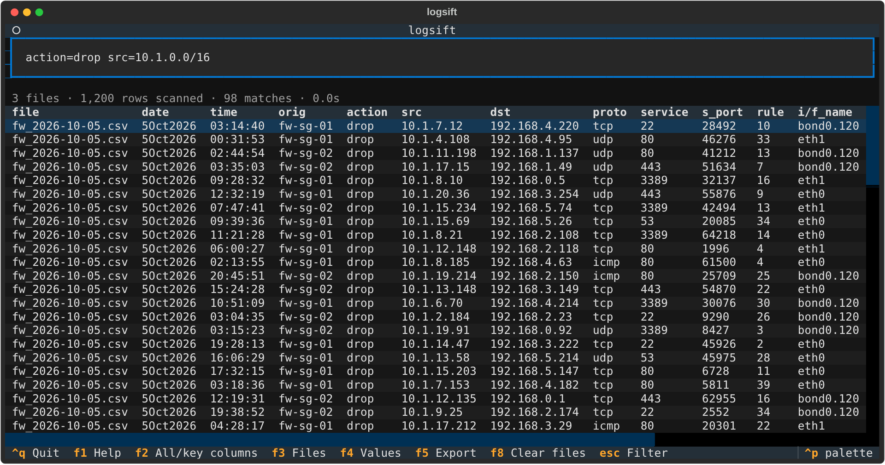
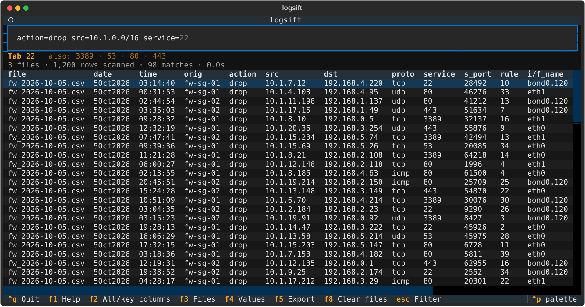
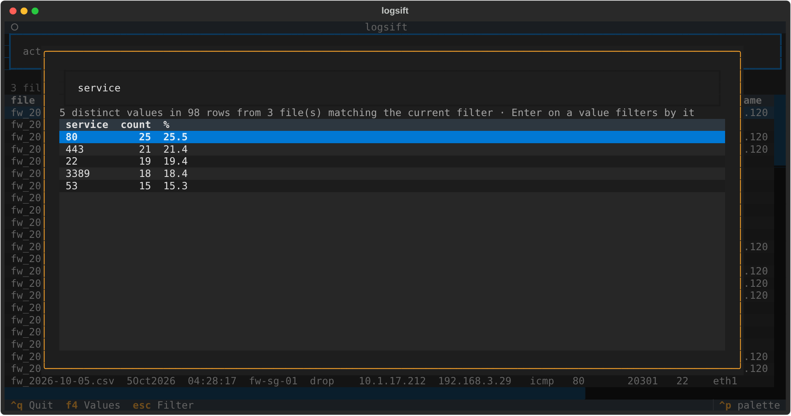
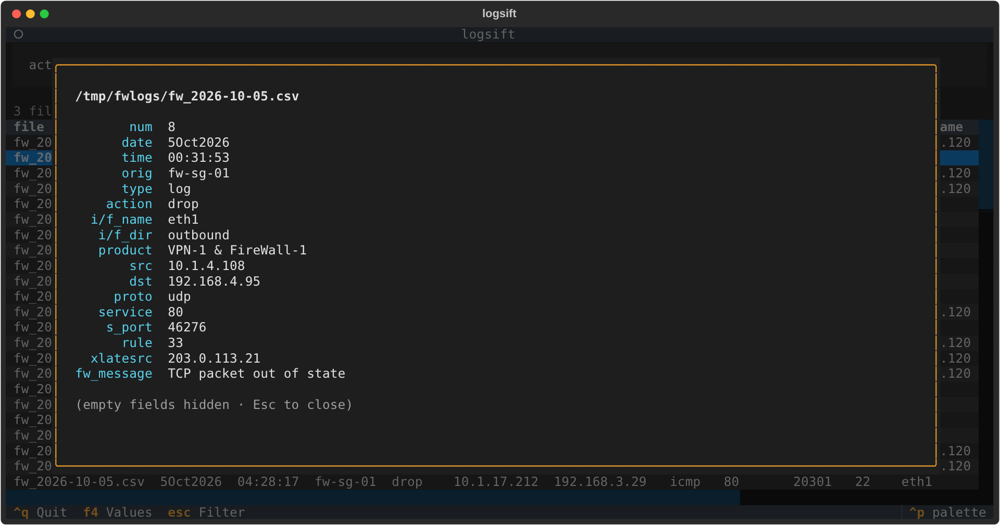

# logsift

Search and filter many CSV, TSV and Excel log files at once from a terminal app. Drag a folder onto the window, type `src=10.1.1.5 action=drop`, and see matching rows from every file.



It was built for firewall log exports, but it works with any table that has a header row: column names are read from the files themselves.

| File type | Notes |
| --- | --- |
| `.csv`, `.tsv`, `.tab` | Comma, tab, semicolon and pipe delimiters are detected per file. |
| `.xlsx`, `.xlsm` | Every non-empty sheet is loaded as its own table, shown as `book.xlsx [Sheet1]`. |
| anything else, dropped directly | Read as delimited text, whatever the extension. |

Old-format `.xls` workbooks are not supported; save them as `.xlsx` or `.csv` first.

## Setup

You need Python 3.8 or newer. Nothing else.

```
git clone https://github.com/sh-how/logsift
cd logsift
python logsift.py
```

The first run downloads its two dependencies ([Textual](https://textual.textualize.io/) for the interface and [openpyxl](https://openpyxl.readthedocs.io/) for Excel files) into a private folder, `~/.logsift`, then starts. This takes about a minute and needs internet once. Later runs start immediately. Nothing is installed into your system Python.

To try it with the sample logs in this repository:

```
python logsift.py examples
```

If setup goes wrong, delete `~/.logsift` and run it again. To install the dependencies yourself instead, run `pip install textual openpyxl`.

## How to use

### 1. Load files

Drag folders or files from your file manager onto the terminal window. Folders are searched recursively for `.csv`, `.tsv`, `.tab`, `.xlsx` and `.xlsm` files. You can also pass them on the command line:

```
python logsift.py /path/to/logs another.csv
```

If your terminal types the dropped path into the filter box instead of loading it, press Enter.

### 2. Filter

Type terms in the filter box and press Enter. Terms separated by spaces must all match.

| Example | Meaning |
| --- | --- |
| `src=10.1.1.5` | exact match (case-insensitive) |
| `action=drop\|reject` | any of several values |
| `dst=192.168.0.0/16` | subnet match, on any column holding IP addresses |
| `src=10.1.*` | wildcard (`*` and `?`) |
| `service!=443` | not equal |
| `fw_message~timeout` | contains |
| `fw_message!~keepalive` | does not contain |
| `dst~/^10\.(1\|2)\./` | regular expression, wrapped in slashes |
| `s_port>=1024` `date>=5Oct2026` | numeric or date comparison |
| `"ICMP Type"=8` | quote column names or values that contain spaces |
| `scheme=IKE` | a trailing colon in a column name (`scheme:`) is optional |
| `vpn-gw-01` | bare word: any column contains it |
| `!keepalive` | no column contains it |
| `file=fw01*` | file name; works with `=`, `!=`, `~` and `!~` like any column |

A mistyped column name gets a suggestion, for example `actoin` gives "Did you mean: action".

### 3. Use the suggestions

As you type, the filter box suggests column names, and after `column=` it suggests values seen in that column, most common first. Press Tab or Right-arrow to accept. The line under the box lists other candidates; keep typing to narrow them.



Value suggestions are sampled from the first 5,000 rows of each file, so a rare value may not be suggested. You can still type it: the search always covers every row. Values containing spaces are suggested once you open a quote, for example `fw_message="c`.

### 4. See what values a column holds

Press F4, type a column name and press Enter. You get every distinct value in that column with its count and percentage, within the current filter. Press Enter on a value to add it to the filter.



### 5. Inspect a row

Press Tab to move to the results, then Enter on a row to see all of its non-empty fields.



### 6. Choose which columns to show

Press F6 to open the column list and tick the columns you want in the results table.

- Type to narrow the list, then press Down to move into it.
- Space ticks or unticks a column. Enter applies. Esc cancels.
- Ctrl+D unticks everything, so you can start from an empty set. Ctrl+R restores the default set.

Your choice stays for the rest of the session, across searches. F2 still switches to all columns and back. Applying with nothing ticked returns to the default set.

To start with columns already chosen:

```
python logsift.py /path/to/logs --columns date,time,src,dst,action
```

### 7. Export

Press F5 to write every matching row to `logsift_export_<timestamp>.csv` in the current directory. The export has a `source_file` column and all columns from the loaded files.

## Keys

| Key | Action |
| --- | --- |
| Enter | run the filter; on a result row, show its details |
| Tab | accept a suggestion, otherwise switch between filter box and results |
| F1 | help and the list of columns |
| F2 | switch between your chosen (or key) columns and all columns |
| F3 | list loaded files |
| F4 | distinct values of a column |
| F5 | export matches to CSV |
| F6 | choose which columns to show |
| F8 | clear loaded files |
| Ctrl+U | clear the filter box (deletes everything before the cursor); press Enter to show all rows again |
| Ctrl+K | delete everything after the cursor |
| Ctrl+W | delete the word before the cursor |
| Esc | close a popup, or return to the filter box |
| Ctrl+Q | quit |

## Things to know

- The table shows the first 2,000 matches. Change this with `--max-rows`. The status line always shows the full match count, and export writes all matches.
- Each search re-reads the files from disk; there is no index. Files are cut into pieces and scanned by several worker processes (one per CPU core, up to 8), so the window stays responsive during a search and a new search replaces a running one.
- Terms such as `src=10.1.1.5`, `action=drop|reject`, `dst=192.168.0.0/16` or `fw_message~timeout` are the fastest: lines that do not contain that text are rejected before they are parsed. Comparisons (`>`, `<`), regular expressions and "not" terms have to parse every line and are slower.
- On a 2-core machine, two 250 MB files (1.8 million rows, 86 columns) take about 1.5 to 2.5 seconds for the fast terms and about 5 seconds for the slow ones.
- Result rows are added to the table as you scroll, so wide tables stay quick.
- `file` filters on the file name (for an Excel sheet, `book.xlsx [Sheet1]`), and files that do not match are not read at all. If a file has its own column called `file`, that column is filtered instead.
- Files with different headers can be loaded together. A filter on a column that a file lacks skips that file, and the status line says how many were skipped.
- Comma, semicolon, tab and pipe delimiters are detected per file.
- An Excel workbook is converted to CSV the first time it is loaded, which takes roughly 10 to 20 seconds per 100,000 rows. The converted copy is kept in `~/.logsift/cache`, so loading the same unchanged workbook again is immediate. Copies not used for 30 days are deleted. Searching a workbook is as fast as searching a CSV.
- Excel dates are shown as `2026-10-07` or `2026-10-07 12:30:00`, and formulas as their last calculated value.
- The first line of each text file, and the first non-empty row of each Excel sheet, is treated as the header.
- Date comparison understands `7Oct2026`, `2026-10-07`, `07/10/2026` and similar. Other formats are compared as text.
- By default the table shows `date`, `time`, `orig`, `action`, `src`, `dst`, `proto`, `service`, `s_port`, `rule`, interface, NAT and `user` columns when they exist, plus any column you filter on. For CSVs with none of these it shows the first 15 columns. F2 shows everything.

The files in `examples/` are generated sample data, not real logs.
